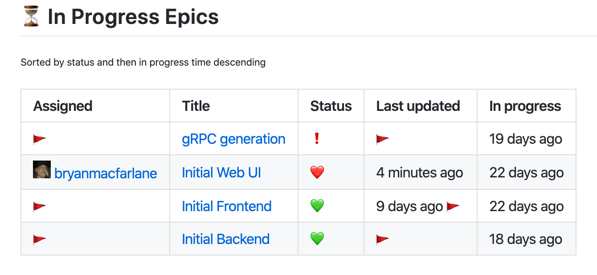

<p align="center">
  
</p>

# :ballot_box_with_check: Project Reports Action

<p align="left">
  <a href="https://github.com/bryanmacfarlane/project-reports/actions?query=workflow%3Abuild-test"></a>
</p>

> Early personal experiment.  Do not rely on this.  Changing rapidly.

An action to generate reports like this ffor a GitHub project board.  Customizable and extensible.



## Use in workflow

1. Create a yaml config file.  See [samples/sample.yaml](./samples/sample.yaml) 
2. Create secret named `PROJECT_TOKEN` in your repo settings.  This token needs to be able to read the project board and reference issue.
3. Add this step to your workflow

```yaml
  - uses: bryanmacfarlane/project-reports@v1-alpha
    with: 
      token: ${{ secrets.PROJECT_TOKEN }}
      configPath: reports-config.yaml
```

Note that the configPath is relative to the root of the repo
See `actions.yml` for more details

Here's a full example including checking in the report after generation.

```yaml
    steps:
      - uses: actions/checkout@v2
      - uses: bryanmacfarlane/project-reports-action@v1-alpha
        with: 
          token: ${{ secrets.PROJECT_TOKEN }}
          configPath: reports-config.yaml
      - run: |
          git config --global user.email "youremail@gmail.com"
          git config --global user.name "Your Name"      
          git add ./_reports
          git commit -a -m "adding reports"
          git push origin master
```

## Dev

```bash
$ npm install   #once
$ npm run build
```

**Interactively run:**  

This seems to work for now.  Runs the action interactively with this dir as the workspace root.

```bash
$ export GHPAT="yourpat-to-read-proj-data"
$ ./interactive.sh samples/sample.yaml
```

After you run it, you should see stuff under _reports.
All the query results will be cached and written to _cache if you want to inspect.
