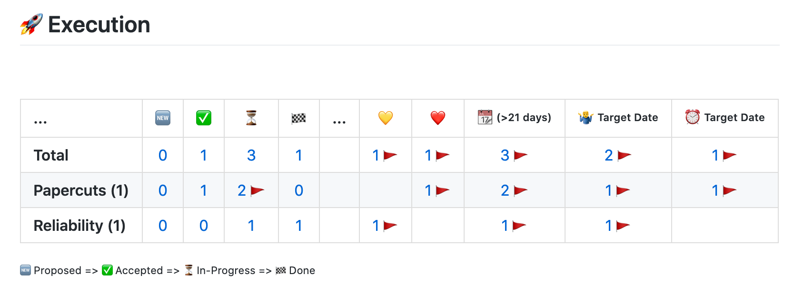

# group-by-status

Shows breakdown counts of each stage, flags in-progress over limits, yellow and red status, in-progress over specified days, missing target dates and past target date.



## Config Options

The config values below are optional with the values shown being the defaults if not supplied.

The limits section is the only values without defaults since they are the labels you specify. If not supplied, there is no work in progress limit for those rows being grouped by.

```yaml
reports:
..
    sections:
      - name: "project-groupby-status"
        config:
          report-on-label: 'feature'
          group-by-label-prefix': '> '
          target-date-comment-field: 'target date'
          flag-in-progress-days': 21
          limits:
            "Papercuts": 1
            "Reliability": 1
```

### report-on-label

Filters by this label. Typically a card type like Epic.

**Default**: `Feature`
**any**: `*` is supported which represents all cards.

### group-by-label-prefix

Group by card issues with a label starting with this prefix. For example, in the [sample feature board](https://github.com/bryanmacfarlane/sample-reports/projects/1) features have labels like `> Papercuts` and `> Reliability` which represents the epic that the feature is part of. See the related [project-reference-labeler](./project-reference-labeler.md) which created those labels by processing the [sample epic board](https://github.com/bryanmacfarlane/sample-reports/projects/2)

**Default**:

```yaml
group-by-label-prefix': '> '
```

Note the space after `>` symbol. That is significant if you don't want to match issues starting with `>>`

### limits

The work in progress limits for the labels specified.

For example, in the [sample feature board](https://github.com/bryanmacfarlane/sample-reports/projects/1) features have labels like `> Papercuts` and `> Reliability` which represents the epic that the feature is part of. See the related [project-reference-labeler](./project-reference-labeler.md) which created those labels by processing the [sample epic board](https://github.com/bryanmacfarlane/sample-reports/projects/2).

So, by specifying, 1 for these in our sample, it will flag the in-progress count if there's more than one. See the image above and note that the papercuts in-progress stage is flagged since the limit is 1 but there are 2 in progress.

```yaml
limits:
  'Papercuts': 1
  'Reliability': 1
```

### target-date-comment-field

The target date field name for the issue. It will first look in the latest issue comment for a value and then fall back to looking for it in the body of the issue.

It will match the field and value on the same line or a separate line. Note that prefixes like the `##` header are ignored and not matched on so there's no need to specify that in your config.

```
target date: 2020-10-21
```

```
## target date

2020-10-21
```

The date values are [any valid javascript date string](https://stackoverflow.com/a/51715260/775184). So, both of these are valid:

```
10-21-2020
2020-10-21
```

An item is considered past target date the day **after** the specified target date.

### flag-in-progress-days

The number of days to flag for being in-progress

**Default**: 21
