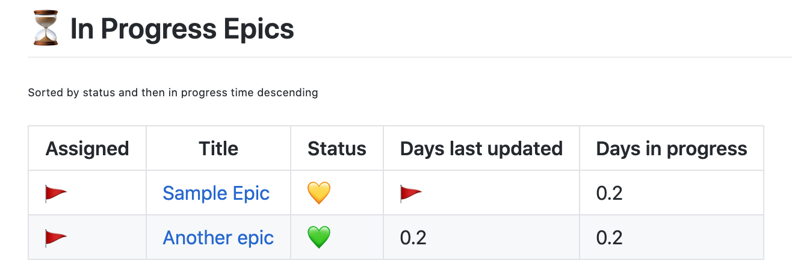

# project-in-progress



## Config Options

The config values below are optional with the values shown being the defaults if not supplied.

```yaml
reports:
..
    sections:
      - name: "project-in-progress"
        config:
          report-on-label: 'Feature'
          status-label-match": "(?:green|yellow|red)"
          last-updated-days-flag: 3.0
          last-updated-scheme": "LastCommentPattern"
          last-updated-scheme-data": "^(#){1,4} [Uu]pdate"
```

### report-on-label

Filters by this label. Typically a card type like Epic.

**Default**: `Feature`
**any**: `*` is supported which represents all cards.

### status-label-match

Status is represented by extracting green, yellow or red out of labels. This setting is a regex pattern. The default pattern simply extracts those labels verbatim. Another example would be to lool for labels like `Status: green`.

**Default**: (?:green|yellow|red)
**Other Example**: (?<=Status:).\*

### last-updated-days-flag

Flag any item that hasn't been updated in these number of days.

**Default**: 3

### last-updated-scheme

The method of detecting an update. Only LastCommentPattern is currently supported which means to get the date updated by looking at the last comment in the issue which matches a pattern.

**Default**: LastCommentPattern

### last-updated-scheme-data

The pattern to match when looking for the last comment. The default is to look for any comment with a markdown header of "Update"

**Default**: ^(#){1,4} [Uu]pdate
